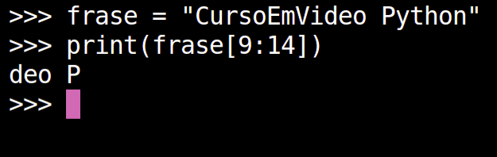

# Curso em Video Python
## Aprendendo um pouco sobre **Python**   
### *Desventando seus metódos e funções*  
- Strings

    - variavel[ começa : termina ]
        - ` frase = "CursoEmVideo Python" print(frase[9:14]) começa na posição 9('d')` `e vai até a 13('') Resultado 'deo P' ` 
        - Este tipo de manipulação é "parecido com o metodo FOR" tendo em vista "Onde vai começar : Onde termina : O passo(pulando de x em x )"
    - len(variavel)
        - ` frase = "CursoEmVideo Python" print(len(frase)) Este método retorna a quantidade em números inteiros de caracteres contido nesta string. Retornando então neste caso 19` 
    - variavel.count('caractere') 
        - ` frase = "CursoEmVideo Python" print(frase.count('o')) Este método retorna a quantidade em números inteiros de caractere ou caracteres definidos anteriormente contido nesta string. Retornando então neste caso 3` 
    - variavel.find('sequencia de caracteres')
        - ` frase = "CursoEmVideo Python" print(frase.find('deo')) Este método retorna a posição dentro da string onde começa o caractere passado no parâmetro. Retornando neste caso 9 pois aparece na posição 9 da string frase ` 
    - ' ' in variavel 
        - ` frase = "CursoEmVideo Python" print('Curso' in frase) Este método retorna se existe ou não a frase passada por parâmetro, Respondendo True se existir e False se não ` 
- Condições (IF)
    - Operadores Lógicos
        - Existem alguns operadores como por exemplo `and, or`
    - Operadores Aritméticos
        - Existem alguns operadores como por exemplo: ` > Operador maior, se o numero da esquerda do operador for maior que o da direta sera retornado True, senão sera retornado False`
        - `< Operador menor, se o numero da esquerda do operador for menor que o da direita sera retornado True, senão sera retornado False`
        -`>= Operador maior igual, se o numero da esquerda do operador for maior ou igual que o da direita sera retornado True, senão sera retornado False `
        - `<= Operador menor igual, se o numero da esquerda do operador for menor ou igual que o da direita sera retornado True, senão sera retornado False `
        -`!= Operador de diferença, se a variavel do lado esquerdo for diferente do lado direito sera retornado True, senão sera retornado False`
        - `== Operador de igualdade, se a variavel do lado esquerdo for igual do lado direito sera retornado True, senão sera retornado False`
        